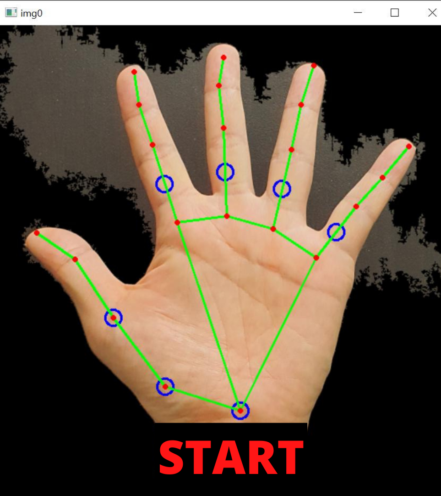
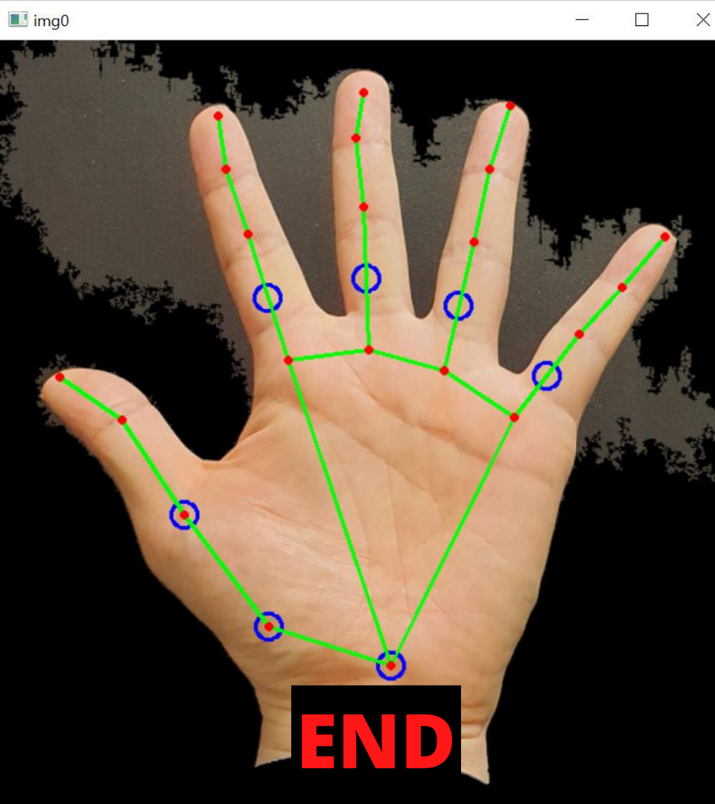

# Welcome to Week 2 
Hello folks, so how is your date going on? We hope that you told your partner how much you like it. 
 
Whattt haven't you done so? 
 
<b>We know you are too shy to speak, so why don't you tell it in sign language?</b>

## Prerequisites
- **Python:** We hope that all of you are familiar with python, if not do checkout this <a href="https://www.youtube.com/watch?v=rfscVS0vtbw">video</a>.
- **Camera Integration:** Next step is to do camera integration with raspi, here is the <a href="https://www.youtube.com/watch?v=VzYGDq0D1mw">tutorial</a>.

## Your Task
You need to do is take input from the camera module, show hand signs to camera so that raspi can decode your message.  
Show three different hand signs and map them to words `I`, `LIKE` and `YOU` , ofcourse in this given order.  
Your message will begin with full open hand position and end with it only.

  
  

All signs between them will be your message and again its obvious that you cannot use this sign for other purposes.
  
**A small hint from our side do checkout mediapipe package of python.**

## Your submission
You need to record a short video inside your raspi, that starts and end with given sign. Your message text should be visible on video as you can see in above images.   
Make sure to avoid high resolution and long videos to prevent memory card from getting full.  
You will recieve submission link at the end of this week. Till then...
   

